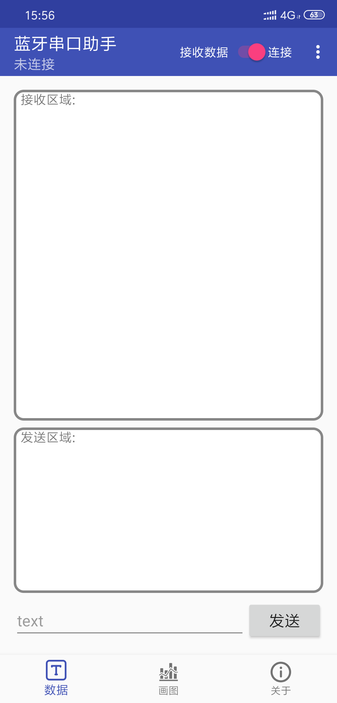
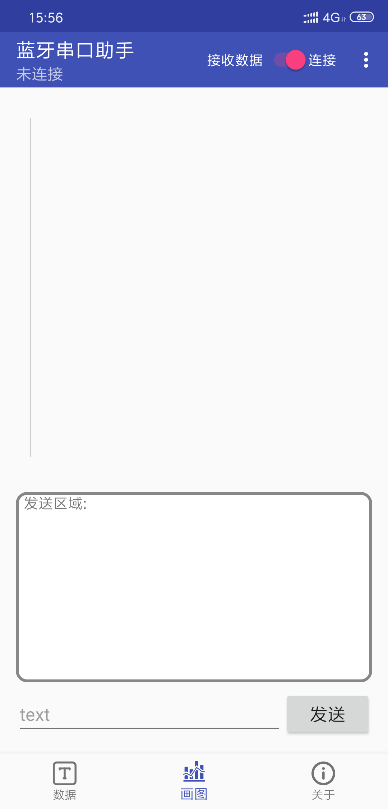

# Bluetooth_serial_assistant

## 软件下载

[here](https://github.com/xkw168/Bluetooth_serial_assisstant/releases/tag/v1.0)

## 软件介绍

&emsp;&emsp;该APP在传统的蓝牙串口助手的基础上，增加了画图功能。具备文字收发功能，同时在接收到的数据为纯数字的时候，支持画图功能。

## 软件截图

文字收发

数据画图（接收到的数据为纯数字）

## 开发环境

1. Android Studio
2. **真机**(注意：虚拟机无蓝牙)

tip: 基于蓝牙4.0及以上
